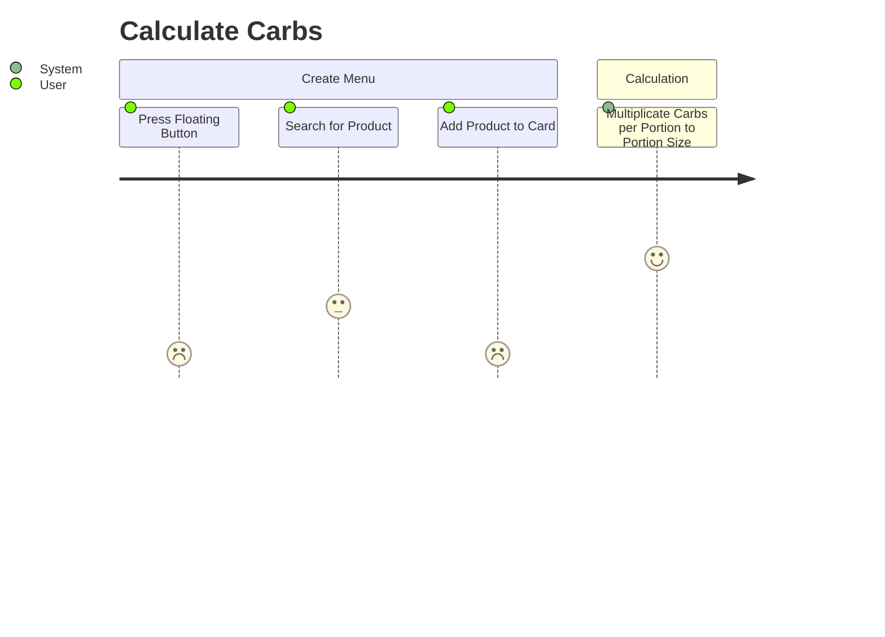

# diabetes_weight_app
App zur Berechnung von Kohlenhydraten an Hand des Gewichts, welches manuell eingegeben oder über eine Bluetooth Waage ermittelt wird.

## Anforderungen
- Mobile App für iOS (optional Android)
- Auswahl von Produkten aus Datenbestand
    - Filtern
    - Sortieren
    - Suchen
    - in Kategorien aufteilen (Baumstruktur)
    - Favoritenliste (zuletzt / am häufigsten verwendet)
- Eingabe des Gewichts der Portion für das Produkt
    - Manuell eingeben
    - von Waage übernehmen via Bluetooth    
- Berechnung der Kohlenhydrate pro Portion
- Ausgabe der berechneten Kohlenhydrate
- Zusammenstellen eines Menüs:
    - Hinzufügen von Portionen zu Menü
    - Summieren von Portionen für identische Produkte
    - Bearbeiten von Produkten
    - Entfernen von Produkten aus Menü
    - Berechnung der gesamten Kohlenhydrate des Menüs

